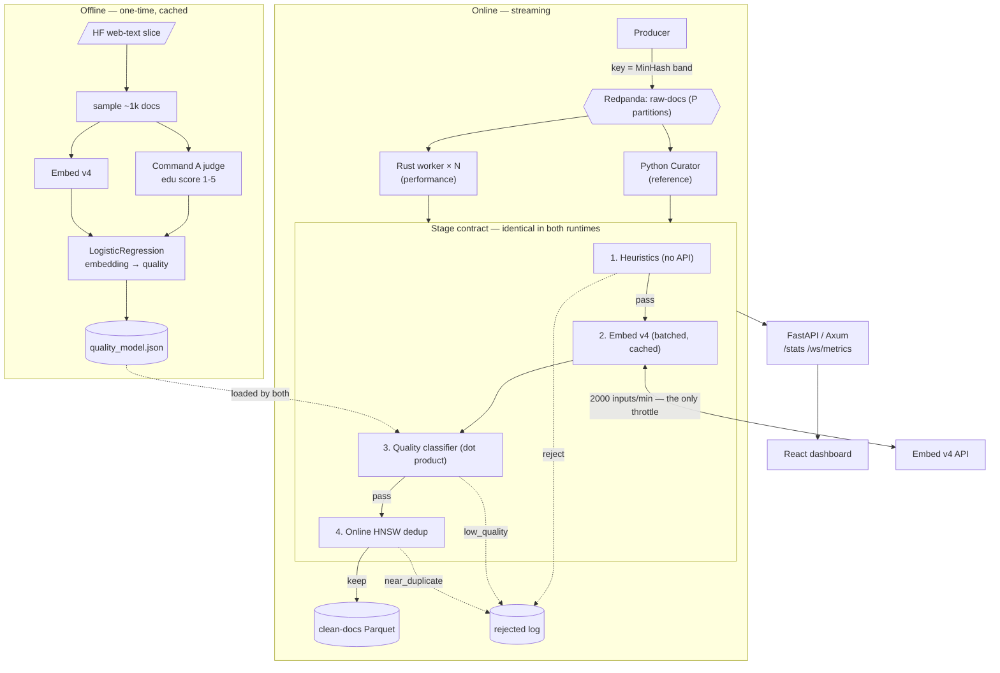
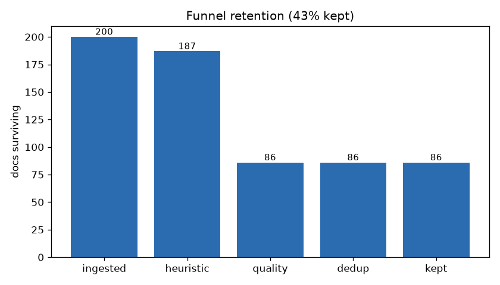
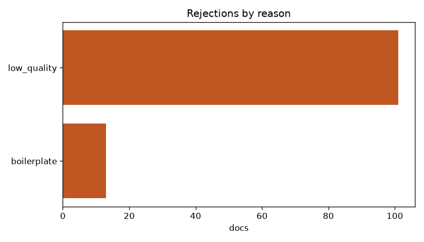
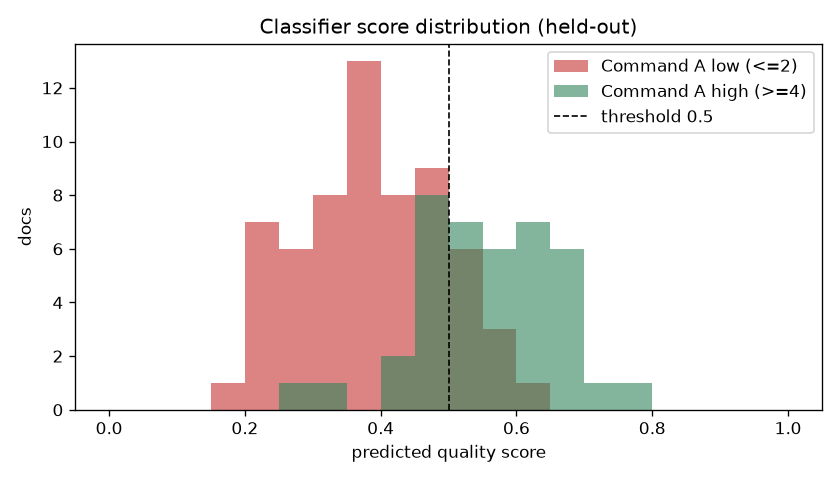
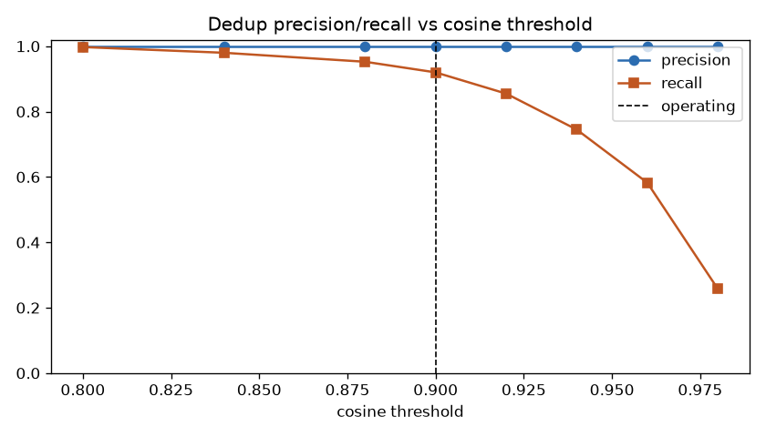
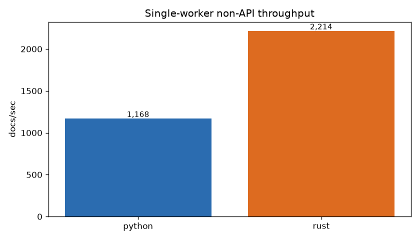
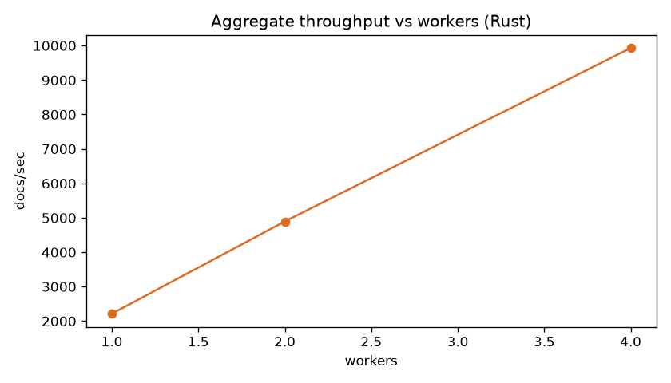
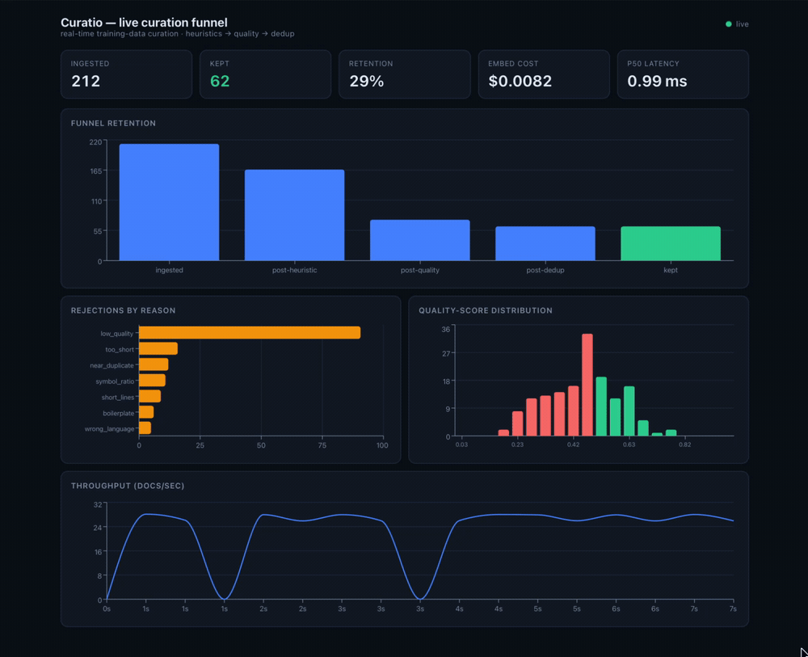

# Curatio

[](https://github.com/minhduc304/curatio/actions/workflows/ci.yml)

**Real-time training-data curation pipeline** on Cohere **Embed v4** + **Command A**.
Curatio replays a web-text stream through heuristic → quality → online-dedup stages and
emits a clean dataset — with a **Python reference implementation** for correctness and a
**Rust performance worker** that makes the same keep/reject calls and scales out.

Curatio is the curation funnel that turns a noisy web-text stream into a clean Parquet dataset,
measured end-to-end — dedup precision/recall, classifier AUC, throughput, and cost.

## Why

At a frontier lab the largest engineering function isn't the model — it's the **data pipeline** that
feeds it: crawl → store → **dedup** → **quality-filter** → store again. That loop is what moves model
quality, and it's the idea behind systems like **SemDeDup** (semantic deduplication) and **FineWeb-Edu**
(classifier-based quality filtering).

Curatio is a scaled-down, single-machine take on that system, with one organizing idea: **let an LLM
define "quality" once, offline — then keep every hot-path decision pure arithmetic.** Command A judges a
sample of documents; that judgment is distilled into a small classifier, so at stream time curation is
just rule checks, a dot product, and vector distances — no LLM in the loop. That's what lets it run at
thousands of docs/sec and scale across workers; the embedding API is the only real throttle.

## Headline numbers

| Curation quality | | Performance (470 pre-embedded docs) | |
|---|---:|---|---:|
| Dedup recall (injected near-dups) | **0.92** | Python hot path | **1,168 docs/sec** |
| Dedup precision | **1.00** | Rust worker, 1 core | **2,214 docs/sec** |
| Distilled classifier AUC (held-out) | **0.87** | Rust worker, 4 cores | **9,929 docs/sec** |
| Funnel retention (200 → 86 kept) | **43%** | Python ↔ Rust decision parity | **100%** |

Every number here reproduces from the committed cache and spends **zero** Cohere quota.
`make bench`, `make stress`, and `make charts` run fully offline; `make eval` also pulls a live
HF stream for the funnel stage, so it needs a network connection (but still makes no paid calls).

## Architecture

Producer → Redpanda (`raw-docs`) → {Python Curator | Rust worker × N} → clean Parquet,
with a live dashboard. A distilled classifier (Command A → logistic regression) does the
quality call so the hot path is a dot product, not an LLM round-trip.



See [`assets/architecture.md`](assets/architecture.md) for the backpressure/offset and parity diagrams.

## How curation works — the funnel

Documents stream through four stages in a fixed order; the first stage a document fails rejects it
(with the reason logged). The cheap, no-API checks run first so the expensive embedding call only
happens on documents that survive.

**1. Heuristics — no API** (`src/curate/heuristics.py`). C4/Gopher-style rules, first failure wins:
length bounds (`too_short` / `too_long`), `symbol_ratio` (too much punctuation/markup), `short_lines`
(nav bars and link lists are many tiny lines), `boilerplate` markers, and `wrong_language`.

**2. Embed v4 — batched + cached** (`src/embedding/service.py`). Each survivor gets a 1024-dim,
L2-normalized embedding. The disk cache is why the whole eval/benchmark reproduces with zero API spend.

**3. Distilled quality classifier** (`src/label/` → `src/curate/quality.py`). Offline and one-time,
Command A scores ~600 docs 1–5 for educational value; dropping the middling 3s leaves ~400 clear
positives and negatives, and a logistic regression on their Embed v4 vectors is exported to
`quality_model.json` (coefficients + intercept, no scaler). At stream time,
inference is `sigmoid(coef · embedding + intercept)` — a **dot product, not an LLM round-trip**. Below
threshold → `low_quality`.

**4. Online semantic dedup** (`src/curate/dedup.py`). An incremental HNSW index (cosine) holds every
kept document; each survivor is compared against everything kept before it, and anything above the
calibrated **0.90** similarity threshold is dropped as `near_duplicate`. *Online* means duplicates are
removed as they arrive, not in a post-hoc batch pass.

Survivors are written to **clean Parquet** (id / text / quality_score / source, DuckDB-readable); a
sampled reject log keeps the dropped documents for inspection. Both runtimes — the Python reference and
the Rust worker — implement this exact contract, and `make bench` refuses to report a throughput number
unless every keep/reject decision is identical between them.

## Results

**Curation funnel** — 200 docs in, 86 kept; 13 dropped by heuristics, 101 by the quality classifier.
The rejects concentrate on `low_quality` by design: this FineWeb slice is already pre-cleaned, so the
cheap heuristic rules catch little and the **distilled classifier does the bulk of the selection** —
exactly the point of distilling an LLM's judgment into the filter. (The live demo injects synthetic
junk + duplicates so every stage is visibly working.)

| | |
|---|---|
|  |  |

**Quality + dedup** — the distilled classifier separates Command A's high/low buckets on held-out
data (AUC 0.87); the dedup threshold (0.90) is the calibrated knee where injected near-dups are
caught at perfect precision.

| | |
|---|---|
|  |  |

**Performance + scale-out** — the hot path clears 1k docs/sec in Python and scales ~linearly
across Rust workers (each worker dedups its own partition).

| | |
|---|---|
|  |  |

**Live dashboard** (`make demo-offline`):



## The throughput story

`make bench` feeds both runtimes a fixed pre-embedded Parquet, **diffs every keep/reject
decision against the Python reference, and refuses to report a throughput number unless they
are 100% identical** (the parity gate). The progression:

```
python (naive langid)   401 docs/sec   ← pure-Python lang-id dominated the hot path (2.1 ms/doc)
python (py3langid)     1168 docs/sec   ← drop-in fork, identical labels, ~6× faster lang-id
rust  × 1              2214 docs/sec   ← whatlang + a dot product + incremental HNSW + MinHash
rust  × 4              9929 docs/sec   ← partition-local dedup, ~4.5× single worker
```

Profiling first paid off more than "rewrite it in Rust": once `langid` was replaced, *both*
runtimes are language-detection-bound, so the single-core Rust win is ~1.9× — the real systems
win is horizontal scale-out (~8.5× aggregate over optimized Python, all at 100% parity). The
content-aware dedup (MinHash routing + verification) adds ~15% to the hot path on both runtimes,
the price of the recall/precision recovery below. The pipeline is never the bottleneck
anyway; the Embed API rate limit (~33 docs/sec) is.

## Limitations

These numbers are measured on a single machine over a few hundred documents, so some are
softer than they look at scale. `make stress` reproduces every figure below (cache-only).
The two dedup limitations are addressed by a content-aware MinHash layer
(`src/curate/minhash.py`) — *measured before → after*:

- **Dedup precision 1.00 was N-limited.** It held only because the corpus is tiny: the
  nearest-prior cosine between *distinct* documents climbs with corpus size, and across 470
  organic docs one distinct pair already collides at **0.93** cosine — a false positive.
  **Fix — surface verification:** a cosine candidate is only dropped if a MinHash-Jaccard
  check agrees. That collision has Jaccard just **0.26**, so it's now kept — **false
  positives 1 → 0**, with true-duplicate recall unchanged.
- **Scale-out traded away recall.** The multi-worker path dedups per partition and keyed the
  stream by doc_id, so a near-dup group scattered across partitions and variants never met
  their original — recall fell **0.92 (1 worker) → 0.59 (2) → 0.33 (4) → 0.15 (8)**. **Fix —
  MinHash-band routing** co-locates a near-dup group on one partition, recovering recall to
  **0.92 → 0.84 → 0.81 → 0.79** at the same worker counts (precision stays 1.0). Single-band
  routing is probabilistic, so recall is high but not perfect; the production-grade version
  routes to multiple LSH bands. *(Both runtimes mirror MinHash — Rust loads the same exported
  permutation params and a cross-language test pins byte-identical signatures, so `make bench`'s
  parity gate stays green with verification active.)*
- **The quality filter is a thin distillation.** AUC 0.87 means "agrees with one Command A
  judge's ranking," trained on ~400 examples (1024-dim) with the middling-scored docs
  dropped — it separates clearly-good from clearly-bad but is unvalidated on the borderline
  majority of a real stream.
- **No downstream validation.** Effectiveness is measured by proxy metrics; the real test —
  does a model trained on the kept set actually improve — is out of scope. And end-to-end
  throughput is gated by the Embed API (~33 docs/sec), not the hot-path numbers above.

## Quickstart

```bash
make install          # venv + python deps + ui (npm)
cp .env.example .env  # add COHERE_API_KEY

# Zero Cohere quota — reproduces every number above from the committed cache:
make eval             # dedup P/R, classifier AUC, funnel (streams HF → needs network)
make bench            # parity gate + Python-vs-Rust + scaling    → fills the benchmark
make stress           # stress tests: precision vs N, recall vs partition count
make charts           # (re)render the 6 PNGs

# Live dashboard, quota-free — replays the eval funnel into the UI:
make demo-offline     # FastAPI + React at http://localhost:5173
```

> **Reproducibility.** The embedding cache, the Command A label set, and the exported
> `quality_model.json` are committed to the repo, so a fresh clone reproduces every number above with
> **zero Cohere spend**. `make bench` and `make demo-offline` run fully offline; `make eval` streams
> the HF slice for the funnel stage, so it needs a network connection but still makes no paid calls.
> Only the Command A distillation (`make label`) or the live producer demo needs an API key.

## Repo layout

```
src/        Python reference: source · curate (heuristics/quality/dedup) · embedding · label · sink · api · metrics
rust/       Rust worker + offline benchmark (cargo)
eval/       inject · run (quality eval) · bench (parity + throughput) · stress · plot — cache-only
ui/         React + Recharts dashboard (Vite)
models/     exported artifacts: quality_model.json (classifier) · minhash.json (shared MinHash params)
assets/     architecture diagram · demo.gif
```

## Stack

Python (reference) · Rust (hot path + benchmark) · Redpanda/Kafka · Cohere Embed v4 + Command A ·
hnswlib / hnsw_rs · scikit-learn · Parquet/DuckDB · FastAPI · React + Recharts.

## License

[MIT](LICENSE)

---

*Status: the curation pipeline, eval, LLM-judge distillation, Rust benchmark, and live dashboard are
built and verified. The live Rust Kafka+Axum serving path is stubbed — the offline benchmark already
proves decision parity and the throughput story.*
