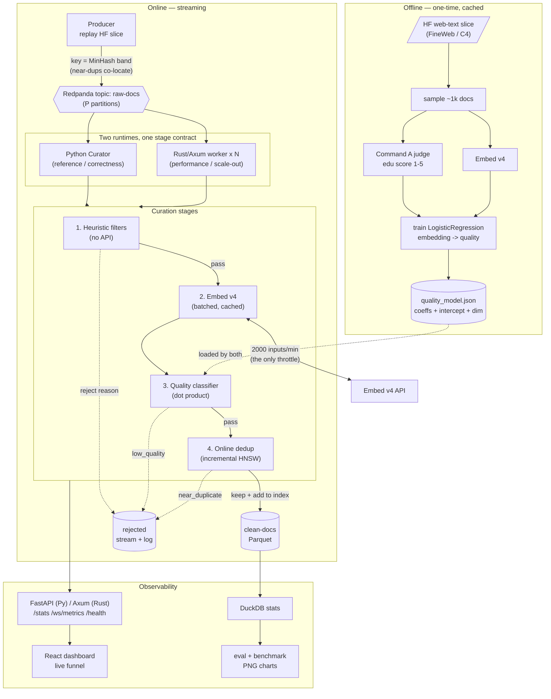
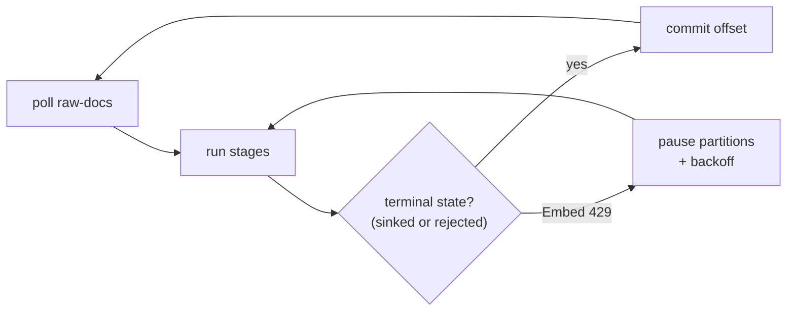

# Curatio — architecture

Renders on GitHub. To produce `architecture.png` for the README, export this
diagram (e.g. mermaid-cli: `mmdc -i assets/architecture.md -o assets/architecture.png`)
or paste the block into the README (GitHub renders mermaid inline).

## Pipeline

## Backpressure & offsets (NFR4)

At-least-once, no silent loss: the offset advances only after a doc is sinked or
rejected. On a sustained Embed 429 the consumer pauses its poll (Kafka buffers
upstream) — throughput drops, correctness holds.

## Python ↔ Rust parity (NFR5 / SC6)

Both runtimes load the same `quality_model.json`, apply identical heuristic rules
in the same order, and build the HNSW index with identical `M`/`ef` and a
single-threaded insertion order. `make bench` diffs each runtime's keep/reject
decision set against the Python reference on a fixed pre-embedded input and refuses
to report a throughput number unless they are 100% identical.
